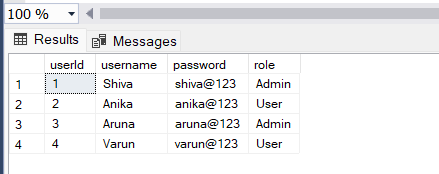
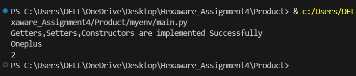

<h3>Create SQL Schema from the product and user class, use the class attributes for table column names.</h3>

> Creating Tables

```sql
Create Database HexawareProductDB
use HexawareProductDB

CREATE TABLE [Product] (
 [productId] INT PRIMARY KEY,
 [productName] VARCHAR(255),
 [description] TEXT,
 [price] FLOAT(53),
 quantityInStock INT,
 [type] VARCHAR(20)
);


CREATE TABLE Electronics(
  [productId] int PRIMARY KEY,
  brand VARCHAR(50),
  warranty_period INT,
  FOREIGN KEY(productId) references Product(productId));


CREATE TABLE Clothing(
  [productId] int PRIMARY KEY,
  size VARCHAR(50),
  color VARCHAR(50),
  FOREIGN KEY(productId) references Product(productId));

CREATE TABLE [User](
  [userId] int,
  username VARCHAR(50),
  [password] VARCHAR(50),
  [role] VARCHAR(50));
```
> Inserting Values
```sql
INSERT INTO [Product] ([productId],[productName],[description],[price],[quantityInStock],[type]) VALUES
(1, 'Phone', 'High-RAM Phone', 2000.5, 5,'Electronics'),
(2, 'Laptop','High-Storage Laptop', 4000.5, 6,'Electronics'),
(3, 'Jeans', 'Denim jeans', 1000.5, 7,'Clothing'),
(4, 'T-shirt', 'Cotton T-shirt', 500.5, 4,'Clothing'),
(5, 'Tablet', 'Tablet Device', 6000.5, 3,'Electronics'),
(6, 'Formal Shirt', 'Causal Shirts', 1200.5, 8,'Clothing')
;
```

```sql
select * from Product;
```

```sql
select * from Electronics;
```

```sql
select * from Clothing;
```

```sql
select * from User;
```


> 1. Create a base class called Product with the following attributes:
• productId (int)
• productName (String)
• description (String)
• price (double)
• quantityInStock (int)
• type (String) [Electronics/Clothing]

```python
class Product:
    def __init__(self, productId, productName, description, price, quantityInStock, type):
        self.productId = productId
        self.productName = productName
        self.description = description
        self.price = price
        self.quantityInStock = quantityInStock
        self.type = type
print("Base Class called product Created Successfully")

```
2. Implement constructors, getters, and setters for the Product class.
```python
class Product:
    def __init__(self, productId, productName, description, price, quantityInStock, type):
        self.productId = productId
        self.productName = productName
        self.description = description
        self.price = price
        self.quantityInStock = quantityInStock
        self.type = type

#Getters---------------------

    def getProductId(self):
       return self.productId

    def getProductName(self):
      return self.productName

    def getDescription(self):
      return self.description

    def getPrice(self):
      return self.price

    def getQuantityInStock(self):
      return self.quantityInStock

    def getType(self):
      return self.type

# Setters----------------------
    def setProductId(self, productId):
      self.productId = productId

    def setProductName(self, productName):
      self.productName = productName

    def setDescription(self, description):
      self.description = description

    def setPrice(self, price):
      self.price = price

    def setQuantityInStock(self, quantityInStock):
      self.quantityInStock = quantityInStock

    def setType(self, type):
      self.type = type

#Implementing
product = Product(1, "Laptop", "High-performance laptop", 1200.0, 10, "Electronics")
# Accessing the productName attribute using the getter method
print(product.getProductName())  

```


> 3. Create a subclass Electronics that inherits from Product. Add attributes specific to electronics 
products, such as:
• brand (String)
• warrantyPeriod (int)

```python
class Electronics(Product):
 def __init__(self, productId, productName, description, price, quantityInStock, type, brand, warrantyPeriod):
  super().__init__(productId, productName, description, price, quantityInStock, type)
  self.brand = brand
  self.warrantyPeriod = warrantyPeriod

 def get_brand(self):
  return self.brand
 
 def set_brand(self, brand):
  self.brand = brand

 def get_warranty_period(self):
  return self.warrantyPeriod
 
 def set_warranty_period(self, warrantyPeriod):
  self.warrantyPeriod = warrantyPeriod

#Implementing-------------------------------------------------------------------------------
electronics_product = Electronics(1, "Phone", "High-RAM phone", 2000.5, 5, 
"Electronics", "Oneplus", 1)
print(electronics_product.get_brand()) 
electronics_product.set_warranty_period(2)
print(electronics_product.get_warranty_period())
```


> 4. Create a subclass Clothing that also inherits from Product. Add attributes specific to clothing 
products, such as:
• size (String)
• color (String)

```python
class Clothing(Product):
 def __init__(self, productId, productName, description, price, quantityInStock, type, size, color):
  super().__init__(productId, productName, description, price, quantityInStock, type)
  self.size = size
  self.color = color

#Getter and Setter 

 def get_size(self):
  return self.size
 
 def set_size(self, size):
  self.size = size

 def get_color(self):
  return self.color
 
 def set_color(self, color):
  self.color = color

#Implementing

clothing_product = Clothing(4, "T-shirt", "Cotton t-shirt", 500.5, 4, "Clothing", "M", "Blue")
print(clothing_product.get_size()) 
clothing_product.set_color("Red")
print(clothing_product.get_color())
```


> 5. Create a User class with attributes:
• userId (int)
• username (String)
• password (String)
• role (String) // "Admin" or "User"

```python
class User:
  def __init__(self, userId, username, password, role):
   self.userId = userId
   self.username = username
   self.password = password
   self.role = role # Either "Admin" or "User"

#Getters

  def get_user_id(self):
   return self.userId
  
  def get_username(self):
   return self.username
  
  def get_password(self):
   return self.password
  
  def get_role(self):
   return self.role
  
#Setters
  
  def set_user_id(self, userId):
   self.userId = userId

  def set_username(self, username):
   self.username = username

  def set_password(self, password):
   self.password = password
  
  def set_role(self, role):
   self.role = role

user1 = User(1, "Shiva", "shiva@123", "Admin")
print(user1.get_username()) 
print(user1.get_role()) 
user2 = User(2, "Anika", "anika@123", "User")
print(user2.get_username()) 
print(user2.get_role()) 
```


> 6. Define an interface/abstract class named IOrderManagementRepository with methods for:
• createOrder(User user, list of products): check the user as already present in database 
to create order or create user (store in database) and create order.
• cancelOrder(int userId, int orderId): check the userid and orderId already present in 
database and cancel the order. if any userId or orderId not present in database throw 
exception corresponding UserNotFound or OrderNotFound exception
• createProduct(User user, Product product): check the admin user as already present in 
database and create product and store in database.
• createUser(User user): create user and store in database for further development.
• getAllProducts(): return all product list from the database.
• getOrderByUser(User user): return all product ordered by specific user from database.

```sql
from abc import ABC, abstractmethod
class IOrderManagementRepository(ABC):
 @abstractmethod
 def createOrder(self, user, products):
  pass
 @abstractmethod
 def cancelOrder(self, userId, orderId):
  pass
 @abstractmethod
 def createProduct(self, user, product):
  pass
 @abstractmethod
 def createUser(self, user):
  pass
 @abstractmethod
 def getAllProducts(self):
  pass
 @abstractmethod
 def getOrderByUser(self, user):
  pass
```
> 7. Implement the IOrderManagementRepository interface/abstractclass in a class called 
OrderProcessor. This class will be responsible for managing orders.
```sql
class OrderProcessor(IOrderManagementRepository):
 def __init__(self):
  self.users = {}
  self.products = {}
  self.orders = {}
 def createOrder(self, user, products):
  if user.userId not in self.users:
   self.createUser(user)
   order_id = len(self.orders) + 1
   self.orders[order_id] = {'user': user, 'products': products}
  return order_id
 
 def cancelOrder(self, userId, orderId):
  if userId not in self.users:
   raise UserNotFound("User with ID {} not found.".format(userId))
  if orderId not in self.orders:
   raise OrderNotFound("Order with ID {} not found.".format(orderId))
  del self.orders[orderId]
 def createProduct(self, user, product):
  if user.role != "Admin":
   raise PermissionError("User does not have permission to create products.")
  self.products[product.productId] = product
 def createUser(self, user):
  self.users[user.userId] = user
 def getAllProducts(self):
  return list(self.products.values())
 def getOrderByUser(self, user):
  user_orders = []
  for order in self.orders.values():
   if order['user'] == user:
    user_orders.append(order)
  return user_orders
 
class UserNotFound(Exception):
 pass
class OrderNotFound(Exception):
 pass

```
> 8. Create DBUtil class and add the following method.
• static getDBConn():Connection Establish a connection to the database and return 
database Connection
```python
import pyodbc

server_name = "DESKTOP-463S8KN\SQLEXPRESS"
database_name = "HexawareProductDB"
 
 
conn_str = (
    f"Driver={{SQL Server}};"
    f"Server={server_name};"
    f"Database={database_name};"
    f"Trusted_Connection=yes;"
)

print(conn_str)
conn = pyodbc.connect(conn_str)
cursor = conn.cursor()
 
 
cursor.execute("Select 1")
print("Database connection is successful 🎊")
```


> 9. Create OrderManagement main class and perform following operation:
• main method to simulate the loan management system. Allow the user to interact with 
the system by entering choice from menu such as "createUser", "createProduct", 
"cancelOrder", "getAllProducts", "getOrderbyUser", "exit".

```sql
class OrderManagement:
 @staticmethod
 def main():
  order_=OrderProcessor()
  print("Welcome to Order Management System")
  while True:
   print("\nMenu:")
   print("1. Create User")
   print("2. Create Product")
   print("3. Cancel Order")
   print("4. Get All Products")
   print("5. Get Orders by User")
   print("6. Exit")
   choice = input("Enter your choice: ")
   if choice == "1":
    OrderManagement.createUser(order_)
   elif choice == "2":
    OrderManagement.createProduct(order_)
   elif choice == "3":
    OrderManagement.cancelOrder(order_)
   elif choice == "4":
    OrderManagement.getAllProducts(order_)
   elif choice == "5":
    OrderManagement.getOrderByUser(order_)
   elif choice == "6":
    print("Exiting...")
    break
   else:
    print("Invalid choice. Please try again.")

 @staticmethod
 def createUser(order_):
  print("Creating a new user...")
  userId=int(input("Enter userID:"))
  userName=input("Enter UserName:")
  password=input("Enter Password:")
  role=input("Enter your role:")
  print("User created successfully.")
  user=User(userId,userName,password,role)
  order_.createUser(user)

@staticmethod
def createProduct(order_):
  print("Creating a new product...")
  productId= int(input("Enter Product ID: "))
  productName = input("Enter Product Name: ")
  description = input("Enter Description: ")
  price = float(input("Enter Price: "))
  quantityInStock = int(input("Enter Quantity in Stock: "))
  type = input("Enter Type (Electronics/Clothing): ")
  product= Product(productId, productName, description, price, quantityInStock,type)
  order_.create_product (None, product) #Assuming None for adais user
  print("Product created successfully.")

@staticmethod
def cancelOrder(order_):
  print("Canceling an order...")
  userId = int(input("Enter User ID: "))
  orderId = int(input("Enter Order ID: "))
  order_.cancel_order (userId, orderId)

@staticmethod
def getAllProducts (order_):
 products = order_.get_all_products()
 print("All Products:")
 for product in products:
   print(product.getProductName())
 print("Retrieving all products...")

@staticmethod
def getOrderByUser(order_):
  print("Retrieving orders by user...")
  userId = int(input("Enter User ID: "))
  orders=order_.get_order_by_user (None) 
  print("Orders by User:")
  for order in orders:
   print("Order ID:", order.getId())
if __name__ == "__main__":
 order_management = OrderManagement()
 order_management.main()
 ```
 
 
